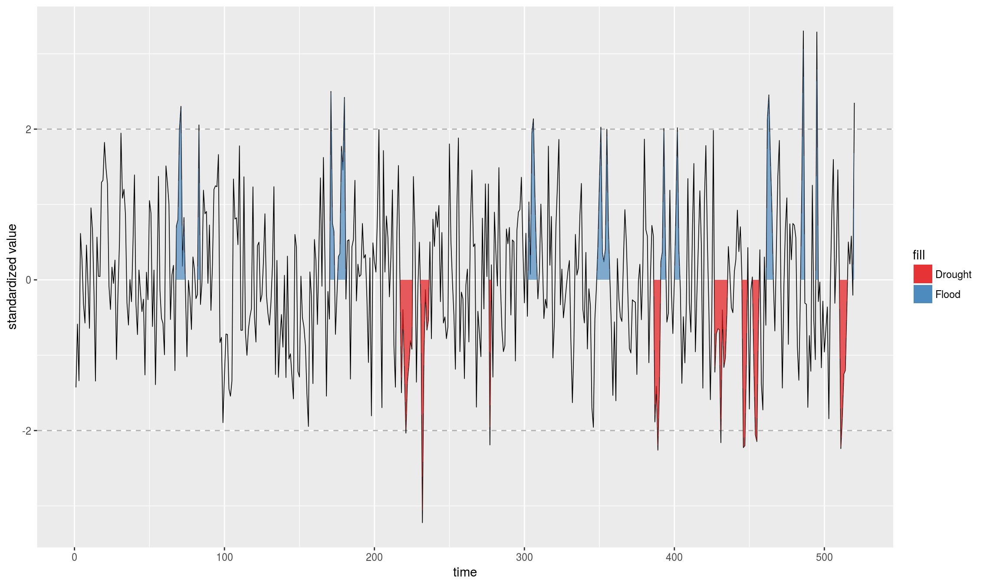

---
output:
  github_document:
    html_preview: false
---


[](https://travis-ci.org/ErickChacon/mbsi)

# About the package: Model-based standardized index

 The mbsi package provide tools to compute and visualize extreme
 hydro-climatic events using the standardized precipitation index
 (SPI) and the model-based standardized index (MBSI). The
 difference with between the MBSPI and the classical SPI index is
 that it consider the association between continuous times using
 cycle P-splines ‘pbc’. The package can also with work with
 precipitation series containing missing values (NA), 0 or only
 non-zero values.

# Installation

This package is not still on CRAN, so installation is done using the `devtools`
package as shown below:


```r
devtools::install_github("ErickChacon/mbsi")
```

# How to use it?


```r
library(mbsi)

data(simrain)

# Compute mbsi
spi_rain <- mbsi(simrain$rain, simrain$time)
```

```
## GAMLSS-RS iteration 1: Global Deviance = -2346.744 
## GAMLSS-RS iteration 2: Global Deviance = -2346.745 
## new prediction 
## new prediction
```

```r
# Visualize model fitting
plot(spi_rain)
```


```r
# Visualize distribution of empirical cumulative density function
plot(spi_rain, which = "ecdf", binwidth = 0.05)
```


```r
# Visualize extreme events
plot_extremes(spi_rain, threshold = 2)
```

```
## Warning: Ignoring unknown aesthetics: event

## Warning: Ignoring unknown aesthetics: event
```


