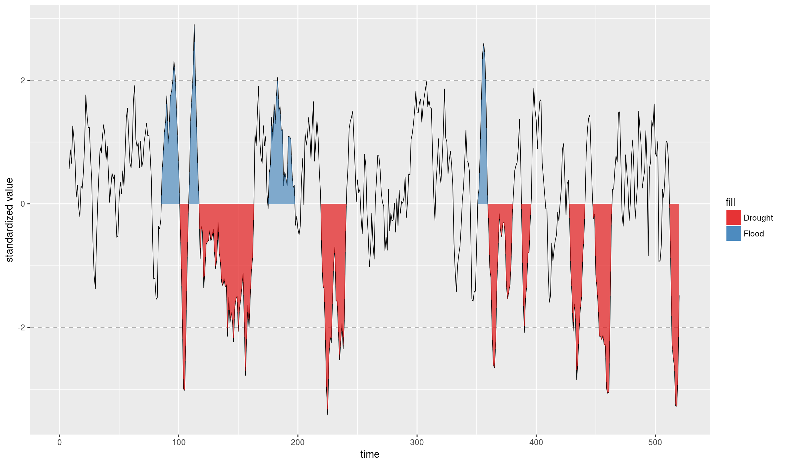

[](https://travis-ci.org/ErickChacon/mbsi)

mbsi: Model-based standardized index
====================================

The mbsi package provide tools to compute and visualize extreme hydro-climatic events using the standardized precipitation index (SPI) and the model-based standardized index (MBSI). The difference with between the MBSPI and the classical SPI index is that it consider the association between continuous times using cycle P-splines ‘pbc’. The package can also with work with precipitation series containing missing values (NA), 0 or only non-zero values.

Installation
============

This package is not still on CRAN, so installation is done using the `devtools` package as shown below:

``` r
devtools::install_github("ErickChacon/mbsi")
```

How to use it?
==============

Analysing the standardized precipitation with time-scale 1
----------------------------------------------------------

``` r
library(mbsi)

data(simrain)

# Compute mbsi
spi_rain <- mbsi(y = simrain$rain, time = simrain$time, tscale = 1, period = 52)
```

    ## GAMLSS-RS iteration 1: Global Deviance = -2344.71 
    ## GAMLSS-RS iteration 2: Global Deviance = -2344.712 
    ## GAMLSS-RS iteration 3: Global Deviance = -2344.712 
    ## new prediction 
    ## new prediction

``` r
# Visualize model fitting
plot(spi_rain)
```


``` r
# Visualize distribution of empirical cumulative density function
plot(spi_rain, which = "ecdf", binwidth = 0.05)
```


``` r
# Visualize extreme events
plot_extremes(spi_rain, threshold = 2)
```

    ## Warning: Ignoring unknown aesthetics: event

    ## Warning: Ignoring unknown aesthetics: event


Analysing the standardized precipitation with time-scale 8
----------------------------------------------------------

``` r
# Compute mbsi
spi_rain_8 <- mbsi(y = simrain$rain, time = simrain$time, tscale = 8, period = 52)
```

    ## GAMLSS-RS iteration 1: Global Deviance = -2344.71 
    ## GAMLSS-RS iteration 2: Global Deviance = -2344.712 
    ## GAMLSS-RS iteration 3: Global Deviance = -2344.712 
    ## new prediction 
    ## new prediction

``` r
# Visualize model fitting
plot(spi_rain_8)
```


``` r
# Visualize distribution of empirical cumulative density function
plot(spi_rain_8, which = "ecdf", binwidth = 0.05)
```

    ## Warning: Removed 7 rows containing non-finite values (stat_bin).


``` r
# Visualize extreme events
plot_extremes(spi_rain_8, threshold = 2)
```

    ## Warning: Ignoring unknown aesthetics: event

    ## Warning: Ignoring unknown aesthetics: event

    ## Warning: Removed 7 rows containing non-finite values (stat_events).

    ## Warning: Removed 7 rows containing non-finite values (stat_events).

    ## Warning: Removed 7 rows containing missing values (geom_path).


